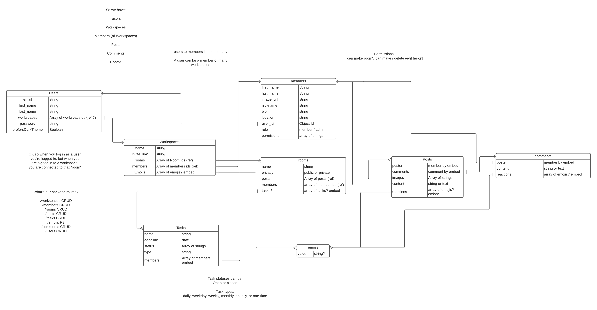

# TaskSare: A Productivity Web Application

## About:
TaskShare is a full stack web application built using the MERN stack. It allows teams to communicate by text in real-time and delegate routine tasks.

For this application I was very inpired by other productivity/communication applications like Slack and GroupMe.

# User Stories:

## Authenication:

  * Every person that wants to access a workspace needs to be signed in and "invited" to it by reaching a specific route by browser.
  
  * However, if the user wants to demo the site, I'll make a demo workspace.

  A non-authenitcated user can:

  - Demo TaskShare in the demo workspace.
  - Sign up for an account.
  - Log in to their account.

  An authenicated user can:

  - Logout of their account.
  - Edit their account information.
  - Delete their account.

## Within a Workspace.

  * In workspaces, a user's role is either a member or admin.

  ** Some functions can only occur if the user has permission.

  A member can:

  - Create a new workspace.
  - Join public rooms.
  - Invite others to public rooms.
  - Join a private room by invite.
  - Create a public room.**
  - Post in a room.**
  - Reply to a post.**
  - Make Tasks.**
  - Edit / Delete Tasks.**
  - Direct Message user(s).
  - Edit / Delete their own posts.

  An Admin can:

  - Do the same as members but don't require permissions.
  - Delete posts / comments that they don't own.
  - Create private rooms and invite other users.
  - Edit the Workspace.

# Wireframes:

# Data Models and ERD:

